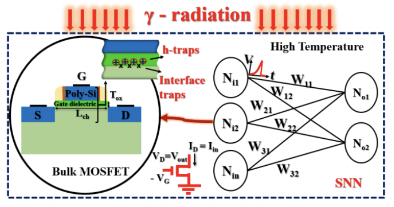

This repository gives the code for the project "TID Effect in Spiking Neural Networks".

**Requirements**

The requirements that are required to run the files are given in 'requirements.txt'.

**Instructions to run train and test files**

1. Run 'python3 snn-train.py' --r requirements.txt

